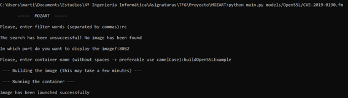

# MOZART: MOdels analyZed & lAunch vulneRable environmenTs

MOZART is a framework solution to enable and help the automatic deployment of vulnerable environments based on Docker containers. MOZART can automatically analyze AMADEUS feature models and deploy that environment.

## Setting up

This software has been implemented and tested in Windows 10. To use it on another operating system, you may have to install some requirements by himself.

### General requirements
The minimum software requirements to run MOZART are:

* Python  3
* An Internet connection

### Windows requirements

* Have running the docker daemon. You may need to install [Docker Desktop](https://docs.docker.com/docker-for-windows/install/) in your system and configure properly to run it.

### Other operating systems requirements

* Have running the docker daemon.
* Have selenium geckodriver configure properly.

### Installation

This step involves the process of retrieving and installing required dependencies (modules) that MOZART requires. To proceed, open a new shell interpreter and simply run the following commands:

```$ cd /path/to/amadeus```
```$ pip install -r requirements.txt```

## Usage

MOZART supports one type of execution. You can type the command ```--help``` to display the following explanatory dialog.

```
$ python main.py -h

usage: main.py [-h] fileDirectoryName

Process a vulnerability feature model

positional arguments:

    fileDirectoryName  input file directory name
                       eg. models/CVE-example.fm

optional arguments:

    -h, --help  show this help message and exit
```

During the execution, MOZART will ask you about filters to use, local port to deploy the container and specific name of this container. If you leave it empty, MOZART use default params (filter = version, localPort = 8080, name = defaultName).

## Output & Example

MOZART's output is a container with product-version of CVE feature models analyzed. In command line it will notify if it has been created and launched successfully.

In order to stage a running example, let's suppose we have CVE whose product-version exists in Docker Hub. MOZART search it and it will try it:


In other case, we have CVE whose product-version does not exist in Docker Hub. MOZART build the corresponding image:


